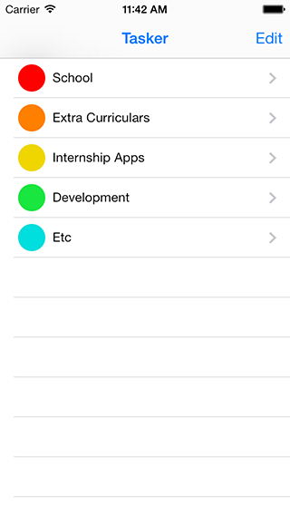
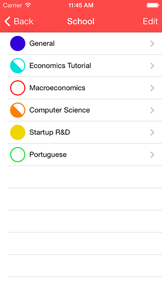
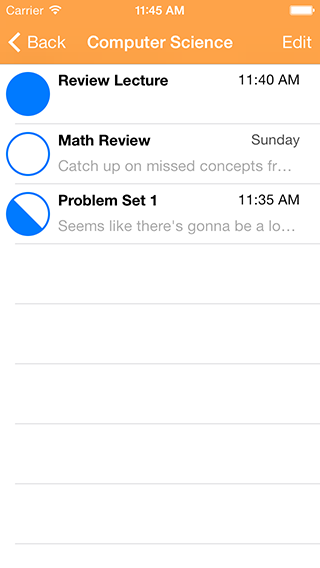
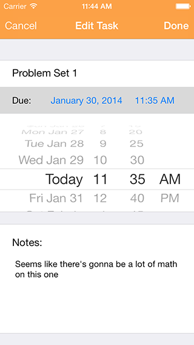

Tasker
======

Tasker iOS App

Tasker lets you organize all the things you need to knock off your to-do list with due dates, categories, progress indicators, and notes. Whether you need to keep track of homework, business or any other deadline or due date, Tasker remembers everything for you so that you can keep your mind clear and get everything done on time.

Tasker is an app I made during the last week of Winter break. It's still a work on progress, there's a lot of stuff
I could add to it.
I quickly whipped it up using Core Data and the very standard tabled interface. It's quite useful for me at school,
where I cant't keep track of everything I have to do!

I think that adding local notifications for reminders and summaries for a particular day would be useful.

It's been on the App Store for about 3 weeks now, and I've pushed an update that has some default information. The
next update will probably include reminders/notifications.

You can get it here:
<a href="https://itunes.apple.com/us/app/tasker-by-nick-chavez/id811348474?mt=8&uo=4" target="itunes_store">Tasker - by Nick Chavez - Nicolas Chavez</a>

Screenshots
===========
 

 

 

 

The MIT License (MIT) 
================================
Copyright © 2014 Nick Chavez

Permission is hereby granted, free of charge, to any person obtaining a copy of this software and associated documentation files (the “Software”), to deal in the Software without restriction, including without limitation the rights to use, copy, modify, merge, publish, distribute, sublicense, and/or sell copies of the Software, and to permit persons to whom the Software is furnished to do so, subject to the following conditions:

The above copyright notice and this permission notice shall be included in all copies or substantial portions of the Software.

THE SOFTWARE IS PROVIDED “AS IS”, WITHOUT WARRANTY OF ANY KIND, EXPRESS OR IMPLIED, INCLUDING BUT NOT LIMITED TO THE WARRANTIES OF MERCHANTABILITY, FITNESS FOR A PARTICULAR PURPOSE AND NONINFRINGEMENT. IN NO EVENT SHALL THE AUTHORS OR COPYRIGHT HOLDERS BE LIABLE FOR ANY CLAIM, DAMAGES OR OTHER LIABILITY, WHETHER IN AN ACTION OF CONTRACT, TORT OR OTHERWISE, ARISING FROM, OUT OF OR IN CONNECTION WITH THE SOFTWARE OR THE USE OR OTHER DEALINGS IN THE SOFTWARE.
